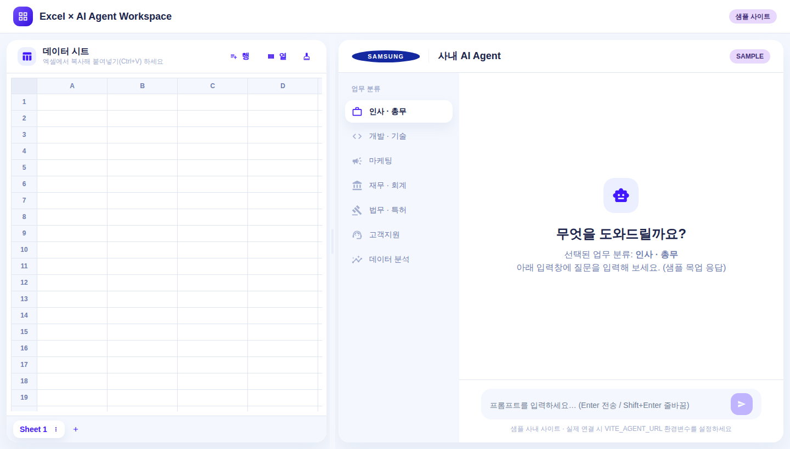

# Excel × AI Agent Workspace

화면을 좌우로 나누어, **왼쪽은 엑셀처럼 데이터를 붙여넣고 확인**하고 **오른쪽에서 사내 AI Agent 웹사이트를 참고**하며 작업할 수 있는 워크스페이스입니다.

React + Chakra UI(Horizon 테마 스타일)로 개발되었고, Vercel 배포에 맞춰져 있습니다.



## 주요 기능

### 왼쪽 — 엑셀 시트 (메모장 컨셉)
- **시트 여러 개** 생성 / 이름 변경(더블클릭) / 삭제
- 엑셀·구글시트에서 복사한 표를 **Ctrl+V 로 붙여넣기** → 탭/줄바꿈을 자동 파싱해 셀에 채움 (필요 시 행·열 자동 확장)
- 셀 직접 편집, 방향키/Tab/Enter 이동
- **행·열 추가**, 시트 비우기
- 입력 내용은 **브라우저 localStorage에 자동 저장** (새로고침해도 유지)
- ※ 순수 데이터 확인/메모 용도로, LLM 연동은 없습니다.

### 오른쪽 — 사내 AI Agent
- 환경변수 `VITE_AGENT_URL` 의 URL을 **iframe으로 로드**
- URL이 없으면 **내장 샘플 사내 사이트**를 표시 (삼성전자 로고 · 업무 분류 · 프롬프트 입력창 목업)
- 사내 사이트가 iframe 삽입을 막는 경우(X-Frame-Options/CSP) **"새 창에서 열기"** 안내 제공

## 로컬 실행

```bash
npm install
npm run dev
```

기본적으로 `http://localhost:5173` 에서 열립니다.

## 환경변수 설정

`.env.example` 를 참고해 `.env` 파일을 만들고 사내 URL을 넣습니다.

```bash
# .env
VITE_AGENT_URL=https://ai-agent.your-company.com
```

- 값을 넣으면 → 오른쪽에 해당 사내 사이트가 iframe으로 표시됩니다.
- 값을 비워두거나 변수를 없애면 → 샘플 사내 사이트가 표시됩니다.

> Vite 특성상 환경변수는 **`VITE_` 접두어**가 있어야 브라우저에서 읽힙니다. 값 변경 후에는 dev 서버를 재시작하세요.

## Vercel 배포

1. 이 저장소를 Vercel 프로젝트로 연결합니다. (Framework: **Vite** 자동 감지, `vercel.json` 포함)
2. 배포 후 **Settings → Environment Variables** 에서 `VITE_AGENT_URL` 를 추가하면 사내 사이트가 연결됩니다.
   - 환경변수를 추가하지 않으면 샘플 사이트가 그대로 표시되므로, URL 없이도 화면 확인이 가능합니다.
   - 환경변수는 빌드 시점에 주입되므로, 값을 추가/변경한 뒤 **재배포(Redeploy)** 가 필요합니다.

## 기술 스택

- Vite + React 18
- Chakra UI (Horizon UI 스타일 테마 커스터마이징)
- react-icons

## 프로젝트 구조

```
src/
  main.jsx / App.jsx          # 진입점, 상단 앱 바 + 좌우 분할
  theme/index.js              # Horizon 스타일 Chakra 테마
  components/
    SplitPane.jsx             # 드래그로 비율 조절되는 좌우 분할
    ExcelPanel.jsx            # 시트 탭 + 그리드 + 행/열 관리
    Grid.jsx                  # 편집 가능한 셀 그리드 (붙여넣기 처리)
    AgentPanel.jsx            # iframe 로드 / 샘플 사이트 분기
    SampleAgentSite.jsx       # 샘플 사내 사이트 목업
    SamsungLogo.jsx           # 삼성 로고 인라인 SVG
  lib/
    paste.js                  # 클립보드 파싱 & 붙여넣기 적용
    storage.js                # 시트 localStorage 저장/로드
```
